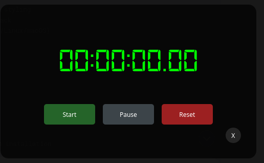

# B-Prime Stopwatch

>[!CAUTION]
>This project is under maintenance due to soeme issue in `setup.py` bprime is not recognised.

<div align="center">
  
</div>

[](https://www.python.org/downloads/)
[](https://pypi.org/project/PyQt5/)
[](https://opensource.org/licenses/MIT)
[](https://pypi.org/project/prime-stopwatch/)

A feature-rich digital stopwatch application with classic styling and modern functionality. Perfect for timing tasks, workouts, or any scenario requiring precise time measurement.

## Installation
```yaml
pip install bprime
```
```yaml
bprime
```
### Prerequisites
```yaml
sudo apt install python3-pyqt5   # System installation
# OR
pip3 install pyqt5               # Pip installation
```
